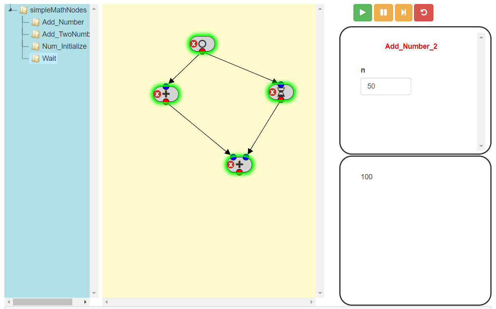

# pipelineR
## Introduction
A pipeline builder for R.  There are two parts to the code - an htmlwidget based on jointJS and an app which can be used to build pipelines.  It's still in its infancy and needs a bit more work.

## Nodes
Nodes are defined in R libraries, utilizing the `comment` function to define inputs and parameters.  The example below (Add_Number) is from the simpleMathNodes library and performs arithmetic to a node.  Here the `comment` is a JSON string and defines the fontawesome icon that's used for this node (plus) along with two parameters.  The first has the symbol `i` and is a `nodeinput` meaning the value is expected as an input from another node.  The second has the symbol `n` and is a numeric.  The further parameters define additional information used to construct the input (min value, max value, default value and step for a numeric input).
```r
Add_Number <- function(i, n) {
  if (all(is.numeric(n), is.numeric(i))) {
    return(list(success = TRUE, output = i + n))
  } else {
    return(list(success = FALSE, output = 'Input must be numeric'))
  }
}
comment(Add_Number) <- '{"icon": "plus", "parameters": [{"name": "i", "type": "nodeinput"},
                         {"name": "n", "type": "numeric", "min": 1, "max": 100, "value": 50, "step": 1}]}'
```

## pipelineR widget
This widget is based on the amazing jointJS library (https://www.jointjs.com/opensource).  It consists of two panes - the left contains the nodes and the right is the paper on which data processing pipelines can be built.  The htmlwidget is called by `jointPipeline` with the following parameters:
- nodes - A list of nodes (see below).
- icons - Boolean.  If true then node icons are displayed on the paper.  If false then the node name is displayed.
Each node is expressed in a named list with the following parameters:
- name = node name
- icon = name of fontAwesome icon for node
- portnames = list containing two elements ('in' and 'out') each of which contain vectors of port names

## Apps
Each example apps builds a pipelineR widget and provides additional functionality to run the pipeline.  Once built the pipeline runs by executing the nodes in order based on a graph.  Execution runs from the nodes without input through the pipeline.  The pipeline can branch in both the forward and backward direction but cannot contain nodes with open inputs nor can it be cyclic.




